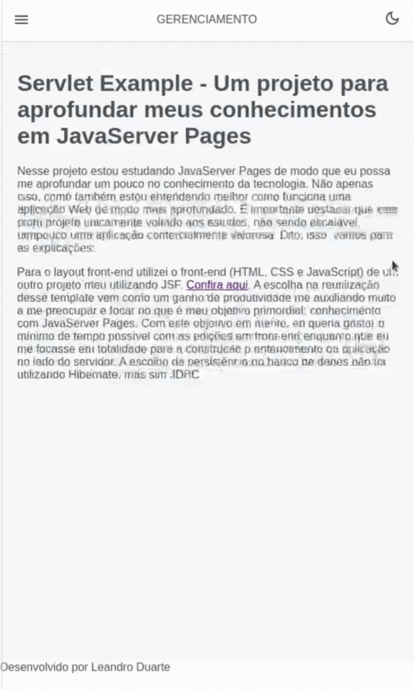

<br />
<div align="center" id="top">
  <a href="https://linkedin.com/in/ldnovaes">
    
  </a>

  <h3 align="center">Projeto JSF para Gerenciamento de Vendas</h3>

  <p align="center">
    Um projetinho desenvolvido como trabalho para o curso de Back-End da EBAC e também para desenvolvimento do meu conhecimento com JavaServer Faces.
    <br />
    <br />
  </p>
</div>


<!-- TABLE OF CONTENTS -->
<details>
  <summary>Conteúdo</summary>
  <ol>
    <li>
      <a href="#sobre">Sobre o Projeto</a>
      <ul>
        <li><a href="#ferramentas">Ferramentas Utilizadas</a></li>
      </ul>
    </li>
    <li>
      <a href="#comeco">Começando</a>
      <ul>
        <li><a href="#requisitos">Requisitos</a></li>
        <li><a href="#deploy">Deploy</a></li>
      </ul>
    </li>
    <li><a href="#uso">Usando</a></li>
    <li><a href="#contato">Contato</a></li>
  </ol>
</details>


<!-- ABOUT THE PROJECT -->
## <span id="sobre">Sobre o Projeto</span>

Nesse projeto estou estudando JavaServer Pages de modo que eu possa me aprofundar um pouco no conhecimento da tecnologia. Não apenas isso, como também estou entendendo melhor como funciona uma aplicação Web de modo mais aprofundado. É importante destacar que este é um projeto unicamente voltado aos estudos, não sendo escalável, tampouco uma aplicação comercialmente valorosa. Dito, isso, vamos para as explicações:

#### Projeto no Computador
<p align="center">
    
</p>

#### Projeto no Celular
<p align="center">
    
</p>

<p align="right">(<a href="#top">Topo</a>)</p>


### <span id="ferramentas">Ferramentas Utilizadas</span>

* 
* 
* 

<p align="right">(<a href="#top">Topo</a>)</p>


## <span id="comeco">Começando</span>

Para o layout front-end utilizei o front-end (HTML, CSS e JavaScript) de um outro projeto meu utilizando JSF. <a href="https://github.com/ldnovaes/gerenciamento-loja-jsf">Confira aqui</a>. A escolha na reutilização desse template vem como um ganho de produtividade me auxiliando muito a me preocupar e focar no que é meu objetivo primordial: conhecimento com JavaServer Pages. Com este objetivo em mente, eu queria gastar o mínimo de tempo possível com as edições em front-end enquanto que eu me focasse em totalidade para a construção e entendimento da aplicação no lado do servidor. A escolha de persistência no banco de dados não foi utilizando Hibernate, mas sim JDBC

#### <span id="requisitos">Requisitos</span>

É importante que você tenha instalado o Docker. Caso não tenha, instale-o de acordo com o seu Sistema Operacional <a href="https://www.docker.com/get-started/">clicando aqui</a>.

Você pode rodar esse projeto em sua máquina, e não é difícil. Comece clonando o repositório

```sh
git clone https://github.com/ldnovaes/servlet-jsp-example.git
```

#### <span id="deploy">Deploy</span>

O projeto foi construído para rodar em um container docker. Ele é auto-implantável. Com isso, com apenas um comando você terá o projeto rodando em sua máquina sem maiores dores de cabeça. Usando um terminal na raiz do projeto clonado, digite:

```sh
docker-compose up -d
```

O argumento `-d` permite a execução do container mesmo que o seu terminal esteja fechado.

Feito isso, o projeto poderá ser executado com <a href="http://localhost:8089/">http://localhost:8089/</a>

<p align="right">(<a href="#top">Topo</a>)</p>


## <span id="uso">Usando</span>

Mais uma vez reforço que este projeto não pretende se tornar um projeto comercial, visto que aqui estará o suficiente para entendimento da tecnologia JavaServe Pages. Dito isso, proponho que você conheça-o melhor clonando e fazendo suas próprias alterações. Esse projeto não está sob nenhuma licença, sendo utilizado por qualquer pessoa.
<p align="right">(<a href="#top">Topo</a>)</p>


## <span id="contato">Contato</span>

* Hotmail - [Envie-me um email](leandroduarte2012@hotmail.com)
* Linkedin - [Envie-me uma DM](https://linkedin.com/in/ldnovaes)


<p align="right">(<a href="#top">Topo</a>)</p>

